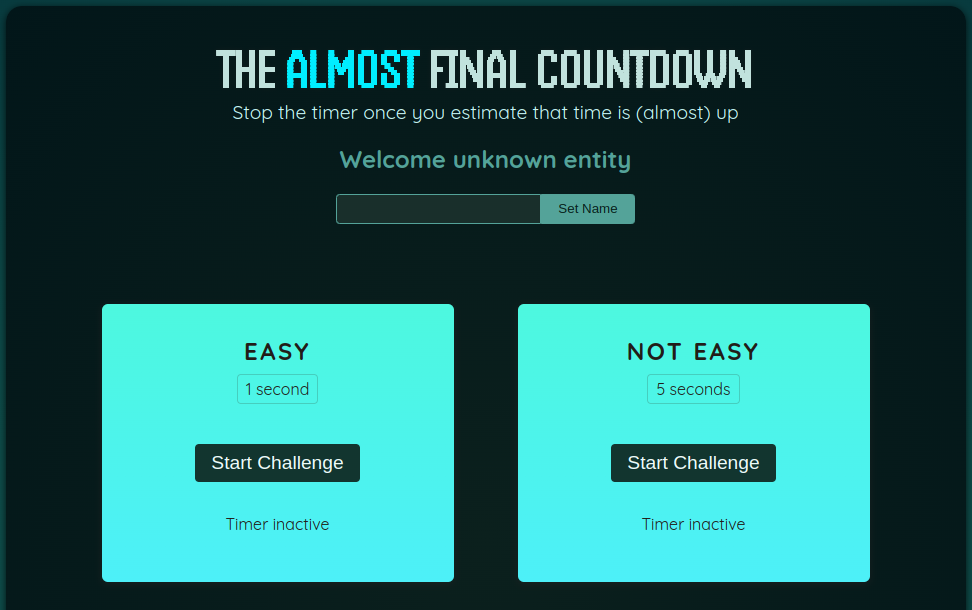

# Timer

## Description
**Timer** is a kind of game where website visitors can initiate different timer challenges with the aim of estimating the elapsed time and stopping the timer early enough before it expires.

## Features
- Launching custom timer challenges.
- Evaluation of elapsed time by users.
- Interactive and intuitive user interface.

## Installation

1. **Clone the repository:**
   ```bash
   git clone https://github.com/Lyrecoph/minuterie.git

2. **Navigate to the project directory :**
    ```bash
    cd minuterie

3. **Install dependencies :**
    ```bash
    npm install

4. **Start the development server :**
    ```bash
    npm run dev

## Usage

- Open your browser to http://localhost:5173 after starting the development server.

- Select a timer challenge and try to stop the timer before it expires.


## Technologies Used

- **React :** For creating the user interface.
- **Vite :** Used as a fast bundler for development.
- **JavaScript (ES6+) :** For application logic.